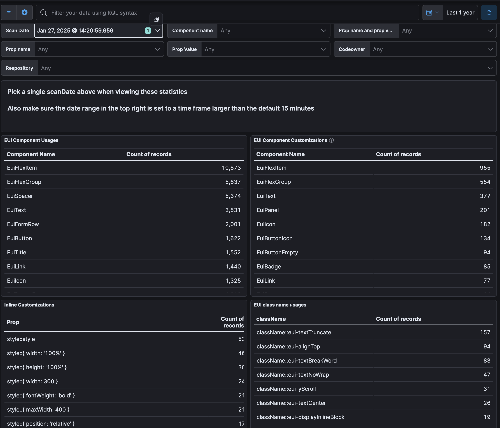

# EUI Usage Analytics

This package contain a script used to collect EUI usage analytics from the Elastic product suite.

Data is collected and shipped to an Elastic Cloud instance, from there the data can be analyzed any number of ways.



## Notes

There is not a lot of magic to this script, it does 2 key things:

- It runs `react-scanner` to collect data on *all* React component usages in our products (Not just EUI)
- It determines the "Code Owner" in which the component usage occured and includes it in the component usage record -- this is key to comparing usage across different teams.


## Setup

This script requires the following to run:

1. The [kibana](https://github.com/elastic/kibana) directory must be cloned to the same directory as the eui repository.
2. `CLOUD_ID_SECRET` and `AUTH_APIKEY_SECRET` of the Elatic Cloud instance for which you would like to ship the data.

## Usage
****
This script must be run from this directory.

```
CLOUD_ID_SECRET=****** AUTH_APIKEY_SECRET=****** node index.js

# Repository roots can be overridden as well. Check --help for more info
CLOUD_ID_SECRET=****** AUTH_APIKEY_SECRET=****** node index.js --kibana-root=/path/to/kibana
```

To do a dry run for testing:
```
node index.js --dry
```

## If you ever need to delete a bad scan:
```
POST /eui_components/_delete_by_query
{
  "query": {
    "term": {
      "@timestamp": "2024-07-22T20:39:38.992Z"
    }
  }
}
```

## Record Schema

This script will store data in an Elastic index named `eui_components`.

It sends the following fields. Each record represents a component usage.

- `@timestamp`
- `scanDate` - Also a timestamp, but this is hardcoded so that an all entires from a single scan share the same date. This lets us group all records together from a single scan. ex: `2025-01-27T21:33:45.723Z`
- `repository` - For now just `kibana`, but in the future this may also include `cloud` or other products we add to the scan.
- `component` - The name of the component. ex: `EuiButton`
- `codeOwners`- An array of codeowners that own the file in which this component usage occurred. ex: `[ '@elastic/kibana-management' ]`
- `moduleName` - The module from which the component being used belongs. ex. `react`, `@elastic/eui`
- `props` - A array of property name value pairs. ex: `[{ propName: 'className', propValue: 'test' }]`
- `props_combined` - An array of property name value pairs contcatenated in a string. We use this since the prop names and values become disassociated when flattened in Elasticsearch. ex: `["className::test"]`
- `fileName` - The file name in which a component usage occurs. ex: `/kibana/src/platform/plugins/shared/es_ui_shared/static/forms/components/fields/card_radio_group_field.tsx`
- `sourceLocation` - A github link to the usage. ex: `'https://github.com/elastic/kibana/blob/main/src/platform/plugins/shared/es_ui_shared/static/forms/components/fields/card_radio_group_field.tsx#L51'`
- `lineNumber` - ex. `51`
- `lineColumn` - ex. `11`


